# Offline Skill Evaluation Framework from dotnet-skills-evals

## Overview

Adopt the best evaluation patterns from [Aaronontheweb/dotnet-skills-evals](https://github.com/Aaronontheweb/dotnet-skills-evals), [sjnims/cc-plugin-eval](https://github.com/sjnims/cc-plugin-eval), and [Anthropic's eval guidance](https://www.anthropic.com/engineering/demystifying-evals-for-ai-agents) to build a comprehensive offline evaluation framework for dotnet-artisan's 131 skills.

Today the plugin validates skill **activation** (does the right skill load?) via structural checks, copilot smoke tests, and live routing tests. This epic adds four missing dimensions:

1. **Effectiveness** — Does loading a skill actually improve output quality? (A/B comparison with LLM judge)
2. **Offline activation** — Can models correctly route to skills without CLI invocation? (API-only, cheap, fast)
3. **Size impact** — Does skill content format (full vs summary vs none) affect quality? (Progressive disclosure validation)
4. **Confusion matrix** — Do overlapping skills cause misrouting? (Disambiguation quality at 131-skill scale)

### Eval Layer Architecture (after this epic)

```
L0: Structural validation (validate-skills.sh)              ← EXISTS
L1: Activation smoke tests (copilot-smoke/run_smoke.py)      ← EXISTS  
L2: Live routing + evidence tiers (check-skills.cs)          ← EXISTS
L3: Offline activation evals (run_activation.py)             ← NEW
L4: Confusion matrix / disambiguation (run_confusion_matrix) ← NEW
L5: Effectiveness evals (run_effectiveness.py)               ← NEW
L6: Size impact evals (run_size_impact.py)                   ← NEW
```

## Scope

**In scope — everything:**
- Offline effectiveness eval runner (Python, A/B comparison + LLM judge)
- Per-skill rubric YAML schema and rubric files (10-15 priority skills to start)
- Offline activation eval with JSONL datasets (50+ positive cases, 15+ negative controls)
- Confusion matrix tests for 7+ domain groups of overlapping skills
- Size impact evals (full vs summary vs baseline, with sibling file testing)
- CI workflow for scheduled evals (weekly)
- Baseline regression tracking for all eval types
- Full documentation updates across all affected files
- Cost controls (model selection, dry-run mode, batching, skip-if-no-rubric)
- Shared infrastructure module (`_common.py`) for config, retry, cost tracking, JSON extraction

## Approach

### Stack

Python (consistent with existing `run_smoke.py`, `_validate_skills.py`). Direct Anthropic SDK API calls — no DSPy or heavy ML framework dependencies. YAML rubrics, JSONL datasets, JSON results.

### Key Design Decisions

1. **Diagnostic first, CI gate later** — All evals run on schedule (weekly) and produce **informational** reports (exit 0 always). They do NOT block PRs. Regression detection reports drops but does not fail the workflow. Gate can be added once baseline stability is proven across multiple runs.

2. **Layered detection for activation** — Force structured JSON response from the routing model (`{"skills": ["skill-id", ...]}`), then programmatic parse is primary. LLM fallback only on JSON parse failures (rare). Avoids the substring false-positive problem found in dotnet-skills-evals.

3. **Compressed routing index format** — Offline activation builds the index dynamically from skill frontmatter: `id + description` only, sorted by id (stable ordering for reproducible baselines), descriptions truncated to 120 chars (matching the style guide limit). Token count of emitted index tracked in results for budget monitoring.

4. **Randomized A/B with deterministic seed** — All pairwise comparisons randomize output ordering to avoid position bias. RNG seed is recorded per run and per case so results are reproducible. A/B assignment recorded in results for bias analysis.

5. **Cost-controlled** — Haiku for iteration, Sonnet for final scoring. Dry-run mode for dataset development. Skip skills without rubrics. Target: <$15 per full suite run.

6. **Shared infrastructure** — All runners share `_common.py` for config loading, Anthropic client wrapper, retry/backoff with jitter, token/cost accounting, run_id/timestamps, JSON extraction, and output writing. Runners stay thin.

7. **Rubric contract** — Rubric YAML files are validated by custom Python checks (no `jsonschema` dep). The `rubric_schema.yaml` file documents the contract but is not a formal JSON Schema. Required fields: `skill_name`, `criteria[]` (each with `name`, `weight`, `description`), `test_prompts[]` (min 1).

8. **Robust judge parsing** — Extract first top-level `{...}` block from judge response via regex, then `json.loads`. On failure: retry up to 2x with progressively stricter "output ONLY JSON" instruction. Store raw judge text on all failures for debugging.

9. **Resume/replay capability** — Store generation outputs separately from judge scores. Re-running judging without regenerating outputs saves cost and enables judge prompt iteration.

10. **Skill content injection** — Strip YAML frontmatter from SKILL.md before injecting into system prompts. Inject body only with explicit delimiters (`--- BEGIN SKILL CONTENT ---` / `--- END SKILL CONTENT ---`) to prevent prompt confusion.

### Summary Extraction (Size Impact)

The "Summary" condition for size impact evals uses a deterministic extraction algorithm:
1. Strip YAML frontmatter (everything between first and second `---`)
2. Extract `## Scope` section (from heading to next `##` heading)
3. Strip code fences and their contents
4. Strip cross-references (keep readable text)
5. Concatenate frontmatter description + extracted scope text
6. Record exact bytes and token count injected per condition in results

### Regression Detection Model

Regression detection is **informational only** (exit 0). Per-eval-type thresholds (separate config keys):
- **Effectiveness**: `mean_drop > 0.5 AND drop > 2*stddev` (per-skill, `min_cases_before_compare: 3`)
- **Activation**: TPR drop > 10% or FPR increase > 5% (per-skill, `min_cases_before_compare: 5`)
- **Confusion**: delta cross-activation > 10% vs baseline (`confusion.cross_activation_change_threshold: 0.10`, per-group, `min_cases_before_compare: 5`). Note: finding flag in reports uses absolute > 20%.
- **Size impact**: score change > 0.5 vs baseline (`size_impact.score_change_threshold: 0.5`, per-skill, `min_cases_before_compare: 3`)
- Per-skill/group minimum sample sizes prevent "n=1" noise regressions
- Results include `mean`, `stddev`, `n` for each metric
- New skills (absent from baseline) are "new coverage", not regressions

### Eval Flow

```mermaid
graph TD
    subgraph "L3: Activation"
        A1[Build compressed index from skills/] --> A2[Present prompt + index to model]
        A2 --> A3[Parse structured JSON response]
        A3 --> A4[Record TPR / FPR / accuracy]
    end
    
    subgraph "L4: Confusion Matrix"
        C1[Group overlapping skills by domain] --> C2[Present ambiguous prompts]
        C2 --> C3[Parse structured skill selections]
        C3 --> C4[Build NxN confusion matrix per group]
    end
    
    subgraph "L5: Effectiveness"
        E1[Load rubric + test prompt] --> E2[Generate WITH skill body]
        E1 --> E3[Generate WITHOUT skill]
        E2 --> E4[Randomize A/B with seeded RNG]
        E3 --> E4
        E4 --> E5[Judge per rubric criteria, extract JSON]
        E5 --> E6[Win rate + mean improvement]
    end
    
    subgraph "L6: Size Impact"
        S1[Select candidate skill] --> S2[Full body / Summary extract / Baseline]
        S2 --> S3[Pairwise judge comparisons]
        S3 --> S4[Identify optimal content level]
    end
```



## Quick commands

```bash
# Activation eval (offline, API-only)
python tests/evals/run_activation.py
python tests/evals/run_activation.py --skill dotnet-xunit --dry-run

# Effectiveness eval (A/B with LLM judge)
python tests/evals/run_effectiveness.py
python tests/evals/run_effectiveness.py --skill dotnet-xunit --runs 3

# Size impact eval
python tests/evals/run_size_impact.py

# Confusion matrix analysis (L4 runner)
python tests/evals/run_confusion_matrix.py
python tests/evals/run_confusion_matrix.py --group testing

# Baseline comparison (any eval type, informational exit 0)
python tests/evals/compare_baseline.py

# Validate rubric contract
python tests/evals/validate_rubrics.py

# Dry run everything
python tests/evals/run_activation.py --dry-run
python tests/evals/run_effectiveness.py --dry-run
python tests/evals/run_size_impact.py --dry-run
python tests/evals/run_confusion_matrix.py --dry-run
```

## Acceptance

- [ ] `tests/evals/` directory with all runners, configs, datasets, rubrics, baselines, and `_common.py`
- [ ] Offline activation eval: 50+ positive cases, 15+ negative controls, structured JSON detection, TPR/FPR/accuracy metrics
- [ ] Effectiveness eval: 10+ skills with rubrics (including `test_prompts`), A/B comparison, win rate + mean improvement
- [ ] Size impact eval: 8+ skills tested at Full/Summary/Baseline with deterministic summary extraction
- [ ] Confusion matrix: 7+ domain groups, NxN activation matrices, cross-activation flagging
- [ ] All evals support `--dry-run` and produce JSON results with `mean`, `stddev`, `n`; L3/L5/L6 support `--skill <name>`, L4 supports `--group <name>`
- [ ] GitHub Actions workflow runs all evals on weekly schedule (informational, exit 0)
- [ ] Baseline regression tracking reports drops with statistical thresholds (not hard-fail)
- [ ] Generations stored separately from judge scores for resume/replay
- [ ] Documentation updated: CONTRIBUTING-SKILLS.md, AGENTS.md, docs/skill-eval-framework.md, README.md, CHANGELOG.md
- [ ] Full eval suite cost documented and under $15 per run
- [ ] `./scripts/validate-skills.sh && ./scripts/validate-marketplace.sh` still pass

## Risks

| Risk | Mitigation |
|------|------------|
| LLM judge non-determinism | temperature=0.0, 3 trials per case, report mean + stddev, seeded RNG for A/B |
| Cost at 131-skill scale | Skip skills without rubrics; Haiku for iteration; resume/replay for judge iteration |
| Rubric quality varies | Template + contract validation; review rubrics in PRs |
| API outages during scheduled runs | Retry with backoff+jitter; partial results are valid |
| Self-evaluation bias | Configurable judge model; document when same model family used |
| Judge output parsing failures | Extract first JSON block via regex; 2 retries with stricter prompt; store raw text |
| Substring false positives in activation | Structured JSON response from model; programmatic parse primary |
| Confusion matrix scale (131 x 131) | Test within domain groups (5-7 skills), not all pairs |
| Skill content injection polluting prompts | Strip YAML frontmatter; use explicit delimiters |
| Shared infrastructure divergence across runners | `_common.py` module created in task .1; runners consume only |

## References

- [Aaronontheweb/dotnet-skills-evals](https://github.com/Aaronontheweb/dotnet-skills-evals) — primary reference: activation, effectiveness, size impact evals
- [sjnims/cc-plugin-eval](https://github.com/sjnims/cc-plugin-eval) — programmatic_first detection, session batching, safety patterns
- [Anthropic: Demystifying Evals](https://www.anthropic.com/engineering/demystifying-evals-for-ai-agents) — canonical eval guidance
- [Agent Skills Best Practices](https://platform.claude.com/docs/en/agents-and-tools/agent-skills/best-practices) — official skill eval recommendations
- [OpenAI: Testing Agent Skills with Evals](https://developers.openai.com/blog/eval-skills/) — routing eval patterns
- [Tool Selection Bias (arXiv 2505.18135)](https://arxiv.org/abs/2505.18135) — assertive cue bias in tool descriptions
- Existing infrastructure: `tests/copilot-smoke/`, `tests/agent-routing/`, `scripts/_validate_skills.py`
- Related completed epics: fn-54 (routing harness), fn-55 (invocation contracts), fn-57 (copilot testing)
