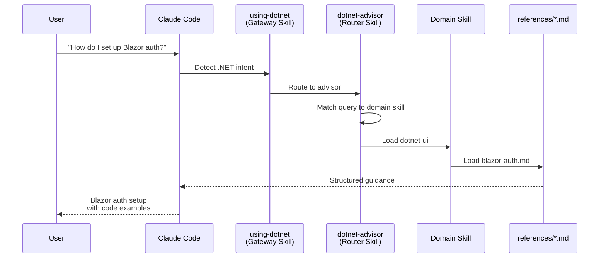

# dotnet-artisan

> Comprehensive .NET development skills for modern C#, ASP.NET, MAUI, Blazor, and cloud-native applications

[](https://github.com/novotnyllc/dotnet-artisan/actions/workflows/validate.yml)
[](LICENSE)
[](.claude-plugin/plugin.json)

## Overview

**dotnet-artisan** provides 9 skills (2 routing + 7 domain) and 14 specialist agents for .NET development. It is compatible with Claude Code, GitHub Copilot CLI, and OpenAI Codex for skill routing. Specialist `agents/*.md` are currently used by Claude/Copilot flows; Codex currently consumes the `skills/*` surface.

The plugin covers the full breadth of the .NET ecosystem:
- Modern C# patterns, async/await, dependency injection, and source generators
- ASP.NET Core APIs, Blazor, MAUI, Uno Platform, WinUI, and WPF
- Entity Framework Core, data access strategies, and serialization
- Testing with xUnit, integration testing, Playwright, and snapshot testing
- CI/CD for GitHub Actions and Azure DevOps
- Native AOT, trimming, performance profiling, and benchmarking
- Security, packaging, documentation, and release management

## Installation

### Claude Code

From within Claude Code, run:

```bash
/plugin marketplace add novotnyllc/dotnet-artisan
/plugin install dotnet-artisan@dotnet-artisan
```

Once installed, Claude Code automatically loads relevant skills based on your questions about .NET development.

### OpenCode (oh-my-opencode)

OpenCode supports Claude Code plugins. Install with Claude Code first using:

```bash
/plugin marketplace add novotnyllc/dotnet-artisan
/plugin install dotnet-artisan@dotnet-artisan
```

Then set this in `~/.config/opencode/oh-my-opencode.json`:

```json
{
  "claude_code": {
    "plugins": true
  }
}
```

### GitHub Copilot CLI

Install as a Copilot plugin:

```bash
copilot plugin marketplace add novotnyllc/dotnet-artisan
copilot plugin install dotnet-artisan@dotnet-artisan
```

The flat `skills/<skill-name>/` layout remains compatible with Copilot's one-level-deep skill scanning.

### OpenAI Codex

Codex discovers plugin-level metadata via the `.agents/openai.yaml` manifest at the repository root. Per-skill Codex metadata belongs in `skills/<skill-name>/agents/openai.yaml`.

Install with:

```bash
$skill-installer install https://github.com/novotnyllc/dotnet-artisan
```

You can also sync skill directories into `~/.codex/skills/`.

For Codex, include per-skill metadata in `skills/<skill-name>/agents/openai.yaml`. Root `agents/*.md` specialist definitions are not yet first-class Codex skills.

## Provider Support Matrix

| Provider | Primary surface | Status |
|---|---|---|
| Claude Code | `.claude-plugin/plugin.json` + `skills/*` + `agents/*.md` + hooks + MCP | Supported |
| GitHub Copilot CLI | `.claude-plugin/plugin.json` + `skills/*` + `agents/*.md` | Supported |
| OpenAI Codex | `.agents/openai.yaml` + `skills/*` + `skills/*/agents/openai.yaml` | Supported (skill-centric) |

Compatibility is validated in CI with structural smoke checks via `scripts/run-agent-routing-smoke.py --provider claude,codex,copilot`.

## Skill Catalog

The plugin organizes 9 skills in a flat directory layout (`skills/<skill-name>/SKILL.md`), backed by 159 reference files (~62K lines) of deep-dive guidance loaded on demand. Each skill follows the [Agent Skills](https://github.com/anthropics/agent-skills) open standard with structured frontmatter and progressive disclosure — SKILL.md routing tables point to `references/*.md` companion files that Claude reads only when relevant.

| Skill | Domain | Key Topics |
|---|---|---|
| **using-dotnet** | Gateway routing | Detects .NET intent, enforces skill invocation before planning |
| **dotnet-advisor** | Router/dispatcher | Routes queries to domain skills, loads coding standards as baseline |
| **dotnet-csharp** | C# language & runtime | Modern patterns, async/await, DI, config, source generators, LINQ, concurrency, SOLID |
| **dotnet-api** | ASP.NET Core & backend | Minimal APIs, EF Core, gRPC, SignalR, security (OWASP), messaging, Aspire, Semantic Kernel, architecture patterns |
| **dotnet-ui** | UI frameworks | Blazor, MAUI, Uno Platform, WPF, WinUI, WinForms, accessibility, localization |
| **dotnet-testing** | Testing & quality | xUnit, integration/E2E, Playwright, BenchmarkDotNet, snapshot testing, test strategy |
| **dotnet-devops** | CI/CD & operations | GitHub Actions, Azure DevOps, containers, NuGet, MSIX, observability, structured logging |
| **dotnet-tooling** | Build & developer tools | MSBuild, Native AOT, trimming, CLI apps, profiling, version detection, project setup |
| **dotnet-debugging** | Debugging | WinDbg debugging, memory analysis, dump file investigation |

## Agents

The plugin includes 14 specialist agents that provide focused expertise in specific domains.

Provider note:
- Claude/Copilot flows can use these specialist agent definitions directly.
- Codex currently routes through broad skills; use the `dotnet-advisor` Codex fallback table to map specialist intents to skills/references.

| Agent | Description |
|---|---|
| **dotnet-architect** | Analyzes project context, requirements, and constraints to recommend architecture approaches, framework choices, and design patterns |
| **dotnet-csharp-concurrency-specialist** | Debugs race conditions, deadlocks, thread safety issues, and synchronization problems in .NET code |
| **dotnet-security-reviewer** | Reviews .NET code for security vulnerabilities, OWASP compliance, secrets exposure, and cryptographic misuse |
| **dotnet-blazor-specialist** | Guides Blazor development across all hosting models (Server, WASM, Hybrid, Auto) including components, state, and auth |
| **dotnet-uno-specialist** | Builds cross-platform Uno Platform apps with Extensions ecosystem, MVUX patterns, Toolkit controls, and MCP integration |
| **dotnet-maui-specialist** | Builds .NET MAUI apps with platform-specific development, Xamarin migration, and Native AOT on iOS/Catalyst |
| **dotnet-performance-analyst** | Analyzes profiling data, benchmark results, GC behavior, and diagnoses performance bottlenecks |
| **dotnet-benchmark-designer** | Designs BenchmarkDotNet benchmarks, prevents measurement bias, and validates benchmark methodology |
| **dotnet-docs-generator** | Generates documentation including Mermaid diagrams, XML doc skeletons, and GitHub-native docs |
| **dotnet-async-performance-specialist** | Analyzes ValueTask correctness, ConfigureAwait decisions, async overhead, ThreadPool tuning |
| **dotnet-aspnetcore-specialist** | Guides middleware authoring, DI patterns, minimal API design, and request pipeline optimization |
| **dotnet-testing-specialist** | Designs test pyramids, unit vs integration vs E2E boundaries, test data management |
| **dotnet-cloud-specialist** | Guides .NET Aspire orchestration, AKS deployment, distributed tracing, infrastructure-as-code |
| **dotnet-code-review-agent** | Performs multi-dimensional code review across correctness, performance, security, and architecture |

## Architecture

### Plugin Structure

```mermaid
graph TB
    subgraph Plugin["dotnet-artisan Plugin"]
        direction TB
        PJ[plugin.json]

        subgraph Agents["14 Specialist Agents"]
            DA[dotnet-architect<br/>Central Router]
            CSC[concurrency-specialist]
            SR[security-reviewer]
            BSA[blazor-specialist]
            US[uno-specialist]
            MS[maui-specialist]
            PA[performance-analyst]
            BD[benchmark-designer]
            DG[docs-generator]
            ASP[async-performance-specialist]
            ASN[aspnetcore-specialist]
            TS[testing-specialist]
            CLS[cloud-specialist]
            CR[code-review-agent]
        end

        subgraph Skills["9 Skills"]
            UD[using-dotnet<br/>Gateway]
            ADV[dotnet-advisor<br/>Router]
            CS[dotnet-csharp<br/>C# Language]
            API[dotnet-api<br/>ASP.NET/Backend]
            UIS[dotnet-ui<br/>UI Frameworks]
            TEST[dotnet-testing<br/>Testing/Quality]
            DEVOPS[dotnet-devops<br/>CI/CD/Ops]
            TOOL[dotnet-tooling<br/>Build/Tools]
            DBG[dotnet-debugging<br/>Debugging]
        end

        subgraph Infra["Infrastructure"]
            HK[hooks/hooks.json]
            MCP[.mcp.json]
        end
    end

    DA --> BSA
    DA --> US
    DA --> MS
    DA --> CSC
    DA --> SR
    DA --> PA
    DA --> BD
    DA --> DG
    DA --> ASP
    DA --> ASN
    DA --> TS
    DA --> CS
    DA --> CR

    BSA --> UIS
    US --> UIS
    MS --> UIS
    CSC --> CS
    SR --> API
    PA --> TOOL
    BD --> TEST
    DG --> TOOL
    DA --> API
    DA --> CS
    UD --> ADV
    ADV --> CS
    ADV --> API
    ADV --> UIS
    ADV --> TEST
    ADV --> DEVOPS
    ADV --> TOOL
    ADV --> DBG
```



### Skill Routing Flow



## Usage Examples

**Ask about project architecture:**
> "I have a new .NET 9 web API project. What architecture pattern should I use for a medium-sized e-commerce backend?"

Claude Code loads `dotnet-api` (read `references/architecture-patterns.md`) and `dotnet-tooling` (read `references/project-structure.md`) to recommend a clean architecture approach with specific project layout, middleware pipeline, and dependency injection configuration.

**Debug a concurrency issue:**
> "I'm getting intermittent failures in my background service that processes messages from a queue. Sometimes messages are processed twice."

The `dotnet-csharp-concurrency-specialist` agent activates, loading `dotnet-csharp` (read `references/async-patterns.md` and `references/concurrency-patterns.md`) to diagnose the race condition and recommend idempotency patterns.

**Set up CI/CD:**
> "Help me create a GitHub Actions workflow that builds, tests, and publishes my NuGet package."

Claude Code loads `dotnet-devops` (read `references/gha-patterns.md`) to generate a complete workflow with proper versioning, test matrix, and NuGet push configuration.

## Agent Skill Routing Checks

This repo includes a CI-ready routing checker to verify that agents discover and use expected skills. Structural validators (`validate-skills.sh`, `validate-marketplace.sh`) run on every push and PR. Live routing checks run via `./test.sh` as optional manual verification.

See `docs/agent-routing-tests.md` for details, workflow inputs, and environment variables.

## Contributing

See [CONTRIBUTING-SKILLS.md](CONTRIBUTING-SKILLS.md) for the skill authoring guide, or [CONTRIBUTING.md](CONTRIBUTING.md) for the general contribution workflow.

## Acknowledgements

- The [Claude Code plugin system](https://docs.anthropic.com/en/docs/claude-code/plugins) and [Agent Skills](https://github.com/anthropics/agent-skills) open standard for enabling structured, discoverable development skills
- The [.NET community and ecosystem](https://dotnet.microsoft.com/) for the frameworks, libraries, and patterns documented in these skills
- All [contributors](https://github.com/novotnyllc/dotnet-artisan/graphs/contributors) who help improve and expand the plugin

## License

This project is licensed under the MIT License. See the [LICENSE](LICENSE) file for details.
